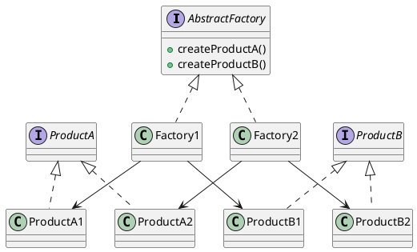

# Abstract Factory Pattern

The abstract factory pattern provides an interface for creating families of related objects without specifying their concrete classes. This example defines two factories that each create a pair of products.

## Class diagram

