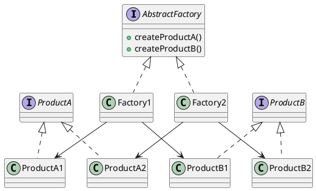

# Abstract Factory

*Creational pattern. Also known as* Kit.

## Intent

Provide an interface for creating families of related or dependent objects without specifying their concrete classes [1, p. 87].

## Motivation

Some systems must be configurable with one of several *families* of products, where the members of a family are designed to be used together. A user interface toolkit that supports several look-and-feel standards is the canonical case: a window, a scroll bar and a button must all belong to the same standard. Instantiating concrete classes throughout the client code makes it hard to guarantee that consistency and hard to switch families later.

Abstract Factory moves all creation into one object per family. The client is written against the abstract factory and the abstract products only, so an entire family can be exchanged by substituting a single factory instance.

## Structure



```plantuml
@startuml
interface AbstractFactory {
    +createProductA()
    +createProductB()
}

interface ProductA
interface ProductB

class Factory1 implements AbstractFactory
class Factory2 implements AbstractFactory

Factory1 --> ProductA1
Factory1 --> ProductB1
Factory2 --> ProductA2
Factory2 --> ProductB2

class ProductA1 implements ProductA
class ProductA2 implements ProductA
class ProductB1 implements ProductB
class ProductB2 implements ProductB
@enduml
```

## Participants

| Role [1] | Class in this package | Responsibility |
|---|---|---|
| AbstractFactory | `AbstractFactory` | Declares one creation operation per abstract product: `createProductA()`, `createProductB()`. |
| ConcreteFactory | `Factory1`, `Factory2` | Each implements the operations for one family, returning `ProductA1`/`ProductB1` and `ProductA2`/`ProductB2` respectively. |
| AbstractProduct | `ProductA`, `ProductB` | Declare the interface of each kind of product. Here both expose only `name()`. |
| ConcreteProduct | `ProductA1`, `ProductA2`, `ProductB1`, `ProductB2` | The products themselves. The digit denotes the family. |
| Client | `AbstractFactoryExampleRunner` | Uses only the abstract types. |

## The example

`AbstractFactoryExampleRunner` creates one instance of each concrete factory and asks each for both of its products, logging the product names. The output shows four products, two per family:

```
Executing Abstract Factory Pattern Implementation:
  ProductA1
  ProductB1
  ProductA2
  ProductB2
```

Note that the runner never mentions a concrete product class. Replacing `new Factory1()` with `new Factory2()` is the only change needed to switch the whole family.

## Consequences

* **Isolates concrete classes.** Product class names appear only inside the concrete factories.
* **Makes exchanging product families easy** and **promotes consistency among products**, since a factory can only produce members of its own family.
* **Supporting new kinds of products is difficult.** Adding a `ProductC` means extending the `AbstractFactory` interface and every concrete factory. The pattern fixes the *set of product kinds* while leaving the *set of families* open, which is the opposite trade-off from Factory Method.

In standard Java, `javax.xml.parsers.DocumentBuilderFactory` and the other JAXP factories follow this pattern: the client obtains a factory and receives a coherent family of parser objects without knowing the provider. In applications built on a dependency-injection container, the container itself often plays the abstract factory role, which is one reason the pattern appears less often in hand-written code today [2].

## Related patterns

* **Factory Method**: concrete factories are frequently implemented with factory methods, one per product.
* **Singleton**: an application usually needs a single instance of a given concrete factory.
* **Prototype**: an alternative way to implement the concrete factories when families are many.

## References

1. E. Gamma, R. Helm, R. Johnson and J. Vlissides, *Design Patterns: Elements of Reusable Object-Oriented Software*. Addison-Wesley, 1994, pp. 87–95.
2. J. Bloch, *Effective Java*, 3rd ed. Addison-Wesley, 2018, Item 1 and Item 5.
3. E. Freeman and E. Robson, *Head First Design Patterns*, 2nd ed. O'Reilly, 2020, ch. 4.
