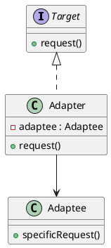

# Adapter Pattern

The adapter pattern allows incompatible interfaces to work together. It wraps an existing class with a new interface so that it can be used as another type.

## Class diagram

```plantuml
@startuml
interface Target {
    +request()
}
class Adaptee {
    +specificRequest()
}
class Adapter implements Target {
    -adaptee : Adaptee
    +request()
}
Adapter --> Adaptee
@enduml
```
