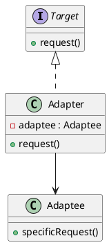

# Adapter

*Structural pattern. Also known as* Wrapper.

## Intent

Convert the interface of a class into another interface clients expect. Adapter lets classes work together that could not otherwise because of incompatible interfaces [1, p. 139].

## Motivation

A useful class often has an interface that does not match the one a client was written against, and neither can be changed: the client may be third-party code and the class may come from a library. Rewriting either to fit the other is costly or impossible. An adapter sits between them, implementing the interface the client expects and translating each call into the operations the existing class provides.

Gamma et al. distinguish the **class adapter**, which inherits from both the target and the adaptee, from the **object adapter**, which implements the target and *holds* the adaptee [1, p. 141]. Java's single inheritance makes the object adapter the usual choice, and it is the form shown here.

## Structure




## Participants

| Role [1] | Class in this package | Responsibility |
|---|---|---|
| Target | `Target` | The domain-specific interface the client uses: `request()`. |
| Client | `AdapterExampleRunner` | Collaborates with objects through `Target` only. |
| Adaptee | `Adaptee` | An existing class with a useful but incompatible operation, `specificRequest()`. |
| Adapter | `Adapter` | Implements `Target` by delegating to the `Adaptee` it was constructed with. |

## The example

The runner creates an `Adaptee`, wraps it in an `Adapter` and calls `request()` through the `Target` reference. The adapter's answer makes the delegation visible:

```
Executing Adapter Pattern Implementation
  Adapter(Adaptee)
```

## Consequences

For the object adapter form used here:

* **One adapter serves many adaptees.** Because it holds a reference rather than inheriting, the same `Adapter` works with any `Adaptee` or subclass of it.
* **Overriding adaptee behaviour is harder.** Changing what the adaptee does requires subclassing it and passing the subclass in, whereas a class adapter could override directly.
* **How much adapting is needed varies** from renaming a method, as here, to synthesising an entirely different protocol.

The Java class library contains many adapters. `java.io.InputStreamReader` adapts a byte-oriented `InputStream` to the character-oriented `Reader` interface, and `java.util.Arrays.asList` adapts an array to the `List` interface. Spring MVC's `HandlerAdapter` lets the dispatcher invoke handlers of different shapes through one interface.

## Related patterns

* **Bridge** has a similar structure but a different purpose: it separates an abstraction from its implementation up front, whereas Adapter reconciles interfaces after the fact.
* **Decorator** also wraps an object, but preserves its interface and adds behaviour rather than translating.
* **Proxy** wraps an object with the same interface to control access to it.

## References

1. E. Gamma, R. Helm, R. Johnson and J. Vlissides, *Design Patterns: Elements of Reusable Object-Oriented Software*. Addison-Wesley, 1994, pp. 139–150.
2. E. Freeman and E. Robson, *Head First Design Patterns*, 2nd ed. O'Reilly, 2020, ch. 7.
