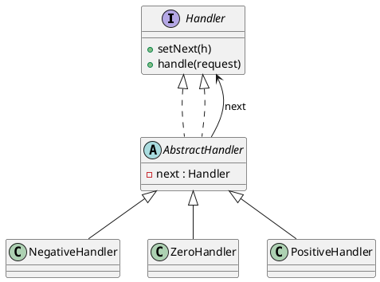

# Chain of Responsibility Pattern

The chain of responsibility pattern passes a request along a chain of handlers until one of them deals with it.

## Class diagram

```plantuml
@startuml
interface Handler {
    +setNext(h)
    +handle(request)
}
abstract class AbstractHandler implements Handler {
    -next : Handler
}
class NegativeHandler extends AbstractHandler
class ZeroHandler extends AbstractHandler
class PositiveHandler extends AbstractHandler
Handler <|.. AbstractHandler
AbstractHandler --> Handler : next
@enduml
```
