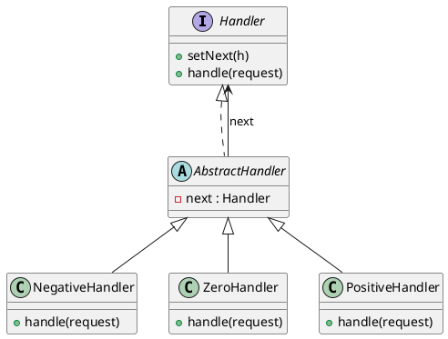

# Chain of Responsibility

*Behavioural pattern.*

## Intent

Avoid coupling the sender of a request to its receiver by giving more than one object a chance to handle the request. Chain the receiving objects and pass the request along the chain until an object handles it [1, p. 223].

## Motivation

Consider a context-sensitive help system: the object that should answer a help request depends on where the user is and how specific the available help is, and the requester cannot know in advance which object that is. Rather than encoding that knowledge in the sender, each candidate receiver is linked to a successor. A receiver either handles the request or forwards it, so the sender only needs a reference to the first link.

## Structure




## Participants

| Role [1] | Class in this package | Responsibility |
|---|---|---|
| Handler | `Handler`, `AbstractHandler` | `Handler` declares `setNext()` and `handle()`. `AbstractHandler` stores the successor and implements the default behaviour: forward if there is a successor, otherwise answer `"unhandled"`. |
| ConcreteHandler | `NegativeHandler`, `ZeroHandler`, `PositiveHandler` | Each handles the requests it is responsible for (negative, zero or positive integers) and defers the rest to `super.handle()`. |
| Client | `ChainOfResponsibilityExampleRunner` | Assembles the chain and sends requests to its first link. |

Gamma et al. observe that the successor link and the default forwarding are best placed in the abstract handler so that concrete handlers only decide whether to act [1, p. 226]. `AbstractHandler` plays that role here.

## The example

The runner links the handlers in the order negative, zero, positive, then sends the requests −1, 0 and 1 to the head of the chain:

```
Executing Chain of Responsibility Pattern Implementation
  -1 is negative
  0 is zero
  1 is positive
```

A request that no handler claims reaches the end of the chain and is reported as `unhandled`. The tests exercise both a request that falls off a shortened chain and a lone handler with no successor.

## Consequences

* **Reduced coupling.** The sender knows neither which handler will act nor how many exist.
* **Added flexibility.** Responsibilities can be redistributed by relinking the chain at run time.
* **Receipt is not guaranteed.** A request may fall off the end. The explicit `"unhandled"` result in `AbstractHandler` makes that outcome visible rather than silent.
* **Cost.** Each request may traverse several handlers before finding a taker.

The literature distinguishes the *pure* form, in which exactly one handler acts and stops the chain, from the *impure* form, in which every handler may act and then pass the request on. This example is pure. Servlet filters (`javax.servlet.FilterChain`), Spring's `HandlerInterceptor` chain and the logger hierarchy of Logback, in which an event propagates to parent loggers' appenders, are impure variants in everyday Java.

## Related patterns

* **Composite**: a component's parent can act as its successor, so the chain follows the object tree.
* **Command**: the request travelling down the chain is often reified as a command object.
* **Decorator**: has the same "linked objects of one interface" shape, but every decorator always acts, whereas a handler chooses.

## References

1. E. Gamma, R. Helm, R. Johnson and J. Vlissides, *Design Patterns: Elements of Reusable Object-Oriented Software*. Addison-Wesley, 1994, pp. 223–232.
2. E. Freeman and E. Robson, *Head First Design Patterns*, 2nd ed. O'Reilly, 2020, appendix "Leftover Patterns".
