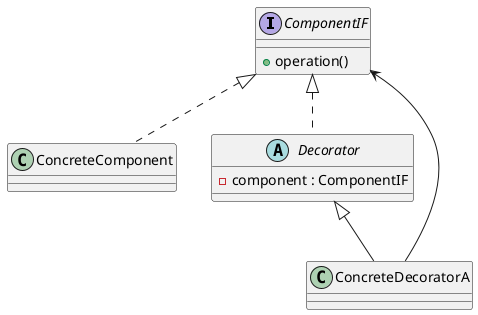

# Decorator Pattern

The decorator pattern attaches additional responsibilities to an object dynamically by wrapping it with decorator classes.

## Class diagram

```plantuml
@startuml
interface ComponentIF {
    +operation()
}
class ConcreteComponent implements ComponentIF
abstract class Decorator implements ComponentIF {
    -component : ComponentIF
}
class ConcreteDecoratorA extends Decorator
ConcreteDecoratorA --> ComponentIF
@enduml
```
