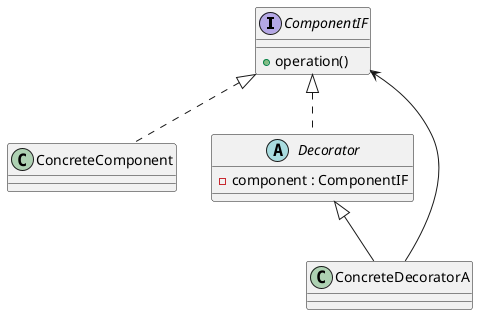

# Decorator

*Structural pattern. Also known as* Wrapper.

## Intent

Attach additional responsibilities to an object dynamically. Decorators provide a flexible alternative to subclassing for extending functionality [1, p. 175].

## Motivation

Adding a border or a scroll bar to any visual component through inheritance would require one subclass per combination of component and feature, and the choice would be fixed at compile time. Enclosing the component in another object that conforms to the same interface, forwards every request to the component and adds its own behaviour before or after, allows features to be combined freely and chosen at run time. Because the decorator has the same interface as what it wraps, it is transparent to clients and decorators can be nested.

## Structure




## Participants

| Role [1] | Class in this package | Responsibility |
|---|---|---|
| Component | `ComponentIF` | The interface shared by objects that can have responsibilities added: `operation()`. |
| ConcreteComponent | `ConcreteComponent` | The object being decorated. |
| Decorator | `Decorator` | Abstract; implements `ComponentIF` and holds a reference to the wrapped component. |
| ConcreteDecorator | `ConcreteDecoratorA` | Adds its responsibility around the delegated call. |

The interface is named `ComponentIF` rather than `Component` to avoid confusion with Spring's `@Component` stereotype, which the example runners use.

## The example

The runner wraps a `ConcreteComponent` in a `ConcreteDecoratorA` and invokes `operation()` on the outer object. The nesting is visible in the result:

```
Executing Decorator Pattern Implementation
  ConcreteDecoratorA(ConcreteComponent)
```

## Consequences

* **More flexible than static inheritance.** Responsibilities are added and removed at run time, and the same decorator can be applied twice.
* **Avoids feature-laden classes high in the hierarchy.** Functionality is paid for only where it is used.
* **A decorator and its component are not identical.** Code that relies on object identity should not be given decorated objects.
* **Many small objects.** Systems built this way are easy to customise but can be hard to learn and debug.

The `java.io` stream classes are the standard Java example: `new BufferedInputStream(new FileInputStream(f))` decorates a byte source with buffering, and further wrappers add decompression or checksumming without changing the type the reader sees. `Collections.unmodifiableList` and `Collections.synchronizedList` are decorators as well. Bloch presents the forwarding-class technique behind the pattern as the recommended alternative to inheritance across package boundaries [2, Item 18].

## Related patterns

* **Adapter** changes an object's interface; Decorator keeps it and changes behaviour.
* **Composite**: a decorator is a degenerate composite with one child, but its purpose is augmentation rather than aggregation.
* **Strategy** changes the guts of an object; Decorator changes its skin.

## References

1. E. Gamma, R. Helm, R. Johnson and J. Vlissides, *Design Patterns: Elements of Reusable Object-Oriented Software*. Addison-Wesley, 1994, pp. 175–184.
2. J. Bloch, *Effective Java*, 3rd ed. Addison-Wesley, 2018, Item 18.
3. E. Freeman and E. Robson, *Head First Design Patterns*, 2nd ed. O'Reilly, 2020, ch. 3.
