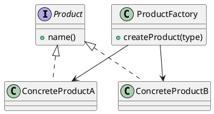

# Factory Pattern

The factory pattern encapsulates object creation logic in a dedicated factory class. The factory decides which concrete product to instantiate.

## Class diagram

```plantuml
@startuml
interface Product {
    +name()
}
class ConcreteProductA implements Product
class ConcreteProductB implements Product
class ProductFactory {
    +createProduct(type)
}
ProductFactory --> ConcreteProductA
ProductFactory --> ConcreteProductB
@enduml
```
