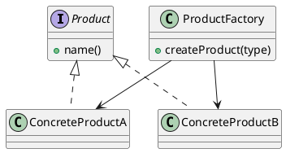

# Factory (Simple Factory)

*Creational idiom.*

## Intent

Centralise the creation of a family of related products behind a single method that decides which concrete class to instantiate, so that clients depend only on the product interface.

## Motivation

Code that instantiates concrete classes with `new` is tied to them: adding a product, renaming one or changing how it is built means editing every client. Gathering those decisions into one place removes the duplication and gives the rest of the program a single point through which products are obtained.

The Simple Factory is not one of the twenty-three patterns catalogued by Gamma et al. Freeman and Robson describe it as "not actually a Design Pattern; it's more of a programming idiom" [3, ch. 4]. It is nevertheless the form most programmers meet first, and it is the stepping stone to the two genuine creational patterns in this collection: the *parameterised factory method* variant of Factory Method [1, p. 110] and Abstract Factory. Bloch's discussion of static factory methods covers the same ground from the API designer's point of view [2, Item 1].

## Structure




## Participants

| Role | Class in this package | Responsibility |
|---|---|---|
| Product | `Product` | The interface every product implements: `name()`. |
| ConcreteProduct | `ConcreteProductA`, `ConcreteProductB` | The classes the factory can instantiate. |
| Factory | `ProductFactory` | `createProduct(type)` maps a type code to a concrete product with a `switch` expression, and rejects unknown codes with `IllegalArgumentException`. |
| Client | `FactoryExampleRunner` | Requests products by type code and uses them through `Product`. |

## The example

The runner asks the factory for a product of type `"A"` and one of type `"B"` and logs their names:

```
Executing Factory Pattern Implementation:
  Concrete Product A
  Concrete Product B
```

The tests also cover the rejection of an unknown type.

## Consequences

* **Creation is encapsulated** in one class, and clients are written against `Product` alone.
* **The factory violates the open-closed principle** [4]: supporting a new product requires modifying the `switch`. Factory Method addresses this through subclassing and Abstract Factory through substituting whole factories, which is precisely what distinguishes them from the idiom.
* **The selection is data-driven**, which is convenient when the type code comes from configuration or user input.

Since Java 14 a `switch` *expression* must be exhaustive, which is why the `default` branch is required here. If the type codes were modelled as an `enum` or the products as a `sealed` hierarchy (Java 17), the compiler could verify that every case is handled and the runtime exception would become unnecessary.

## Related patterns

* **Factory Method** moves the decision into subclasses of a creator.
* **Abstract Factory** groups several factory operations into one object per product family.

## References

1. E. Gamma, R. Helm, R. Johnson and J. Vlissides, *Design Patterns: Elements of Reusable Object-Oriented Software*. Addison-Wesley, 1994, pp. 107–116.
2. J. Bloch, *Effective Java*, 3rd ed. Addison-Wesley, 2018, Item 1.
3. E. Freeman and E. Robson, *Head First Design Patterns*, 2nd ed. O'Reilly, 2020, ch. 4.
4. B. Meyer, *Object-Oriented Software Construction*. Prentice Hall, 1988, §2.3 (the open-closed principle).
