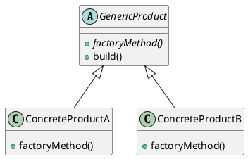

# Factory Method

*Creational pattern. Also known as* Virtual Constructor.

## Intent

Define an interface for creating an object, but let subclasses decide which class to instantiate. Factory Method lets a class defer instantiation to subclasses [1, p. 107].

## Motivation

A framework often knows *when* an object must be created but not *which* class it should be, because that class is application-specific. The framework class therefore declares a creation operation, calls it at the appropriate point in its own algorithms, and leaves its implementation to subclasses supplied by the application. Gamma et al. remark that "Factory Methods are usually called within Template Methods" [1, p. 116], and that relationship is the essence of this example.

## Structure




## Participants

| Role [1] | Class in this package | Responsibility |
|---|---|---|
| Creator | `GenericProduct` | Declares the abstract `factoryMethod()` and calls it from `build()`, its template operation. |
| ConcreteCreator | `ConcreteProductA`, `ConcreteProductB` | Override `factoryMethod()` to decide what is created. |
| Product | the value returned by `factoryMethod()` | In this reduced example the product is represented by a `String` naming what was built, so the product hierarchy of the canonical diagram collapses to a value. |

The class names emphasise the creator hierarchy; readers comparing this with the textbook structure should map `GenericProduct` to *Creator* rather than to *Product*.

## The example

The runner instantiates both concrete creators through the `GenericProduct` type and calls `build()` on each. The base class logs what the subclass decided to produce:

```
Executing Factory Method pattern implementation:
  Building Concrete Product A
  Building Concrete Product B
```

## Consequences

* **Eliminates the need to bind application-specific classes into framework code.** The base class works with whatever the subclass returns.
* **Provides hooks for subclasses.** A factory method is a natural extension point.
* **Connects parallel class hierarchies**, letting a creator hierarchy mirror a product hierarchy.
* **Clients may have to subclass just to create a product**, which is the pattern's main drawback when the creator hierarchy does not already exist.

`Iterable.iterator()` is the most pervasive factory method in Java: every collection decides which `Iterator` implementation to instantiate, and clients never name it. Bloch's *static factory method* [2, Item 1] is a different technique despite the similar name: it is a static method with no subclassing involved, closer to the Simple Factory idiom in this collection.

## Related patterns

* **Template Method**: the operation that calls the factory method is typically a template method, as `build()` is here.
* **Abstract Factory**: often implemented with factory methods.
* **Prototype**: avoids subclassing the creator by cloning a prototype instead.

## References

1. E. Gamma, R. Helm, R. Johnson and J. Vlissides, *Design Patterns: Elements of Reusable Object-Oriented Software*. Addison-Wesley, 1994, pp. 107–116.
2. J. Bloch, *Effective Java*, 3rd ed. Addison-Wesley, 2018, Item 1.
3. E. Freeman and E. Robson, *Head First Design Patterns*, 2nd ed. O'Reilly, 2020, ch. 4.
