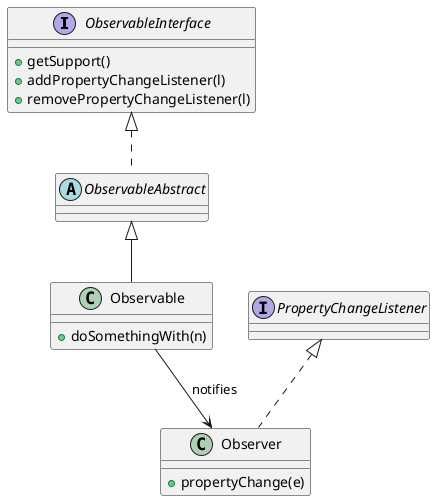

# Observer Pattern

The observer pattern defines a one-to-many dependency so that when one object changes state, its dependents are notified automatically.

## Class diagram

```plantuml
@startuml
interface ObservableInterface {
    +getSupport()
    +addPropertyChangeListener(l)
    +removePropertyChangeListener(l)
}
abstract class ObservableAbstract implements ObservableInterface
class Observable extends ObservableAbstract {
    +doSomethingWith(n)
}
class Observer implements PropertyChangeListener {
    +propertyChange(e)
}
Observable --> Observer : notifies
@enduml
```
