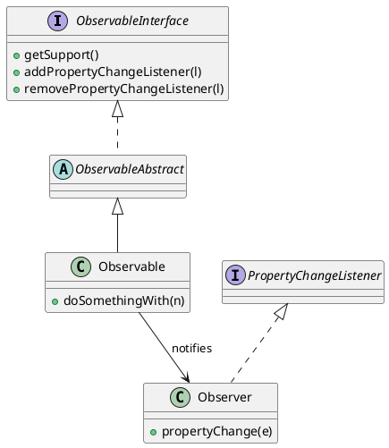

# Observer

*Behavioural pattern. Also known as* Dependents, Publish-Subscribe.

## Intent

Define a one-to-many dependency between objects so that when one object changes state, all its dependents are notified and updated automatically [1, p. 293].

## Motivation

A spreadsheet cell and the charts drawn from it must stay consistent, yet the cell should not know which charts exist or how they render. Observer separates the *subject* holding the state from the *observers* interested in it. Observers register with the subject; the subject notifies every registered observer when its state changes and each observer pulls or receives whatever it needs. The subject depends only on an abstract observer interface, so observers can be added without modifying it.

## Structure




## Participants

| Role [1] | Class in this package | Responsibility |
|---|---|---|
| Subject | `ObservableInterface`, `ObservableAbstract` | Know their observers and offer registration. `ObservableAbstract` delegates the bookkeeping to a `java.beans.PropertyChangeSupport` and adds `removeAllListeners()`. |
| ConcreteSubject | `Observable` | Holds the state of interest. `doSomethingWith(n)` derives a new value and fires a `"myProperty"` change event. |
| Observer | `java.beans.PropertyChangeListener` | The notification interface, taken from the standard library. |
| ConcreteObserver | `Observer` | Logs the property name and its old and new values. |

The example uses the *push* model: the event carries the old and new values, so observers need not query the subject. `PropertyChangeSupport` is the JavaBeans realisation of the pattern [2] and remains the idiomatic choice for in-process observation. The older `java.util.Observable` is deprecated since Java 9 because it is a class rather than an interface, offers no thread-safety guarantees and does not specify notification order [3].

## The example

The runner creates two subjects and one observer, registers the observer with both, and triggers a change on each:

```
Executing Observer pattern:
  Property updated!. "myProperty": 5->7
  Property updated!. "myProperty": 10->16
```

The new value is the old one plus a random increment, so the exact numbers vary between runs. A subtlety worth knowing: `PropertyChangeSupport.firePropertyChange` suppresses the event when the old and new values are equal, so on the rare run where the random increment is zero no line is printed. The unit test accounts for this by retrying until an event is observed.

## Consequences

* **Abstract coupling** between subject and observer: the subject knows only that it has a list of `PropertyChangeListener`s.
* **Support for broadcast.** The subject does not care how many observers there are.
* **Unexpected updates.** Because observers are ignorant of one another, a seemingly innocent change can cascade, and the cost of an update is not visible at the call site.
* **The lapsed-listener problem.** An observer that is never unregistered stays reachable from the subject and cannot be garbage collected. `removeAllListeners()` exists so a subject can release its observers when it is done with them.

Swing's event listeners, Spring's `ApplicationEvent` mechanism and the `java.util.concurrent.Flow` interfaces introduced in Java 9 for reactive streams are all instances of the pattern at different scales.

## Related patterns

* **Mediator**: when the update logic between many subjects and observers becomes complex, a mediator can centralise it.
* **Singleton**: a mediator or change manager is often unique.

## References

1. E. Gamma, R. Helm, R. Johnson and J. Vlissides, *Design Patterns: Elements of Reusable Object-Oriented Software*. Addison-Wesley, 1994, pp. 293–303.
2. G. Hamilton (ed.), *JavaBeans API Specification*, version 1.01. Sun Microsystems, 1997, §7 (Properties, bound properties).
3. Oracle, *Java Platform SE API Specification*, class `java.util.Observable`, deprecation note.
4. E. Freeman and E. Robson, *Head First Design Patterns*, 2nd ed. O'Reilly, 2020, ch. 2.
