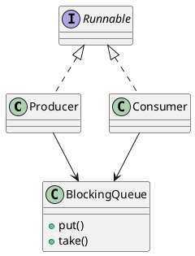

# Producer / Consumer

The Producer/Consumer is a concurrency model where producer threads generate data and place it into a shared, thread-safe buffer (like a queue), while consumer threads retrieve and process that data. It helps decouple the creation and processing of data, allowing both to operate at different speeds. Synchronization mechanisms like locks or semaphores are used to ensure safe access to the buffer, preventing race conditions and deadlocks. This pattern is commonly used in logging systems, task queues, and real-time processing pipelines to improve scalability and responsiveness in multithreaded applications.

In this example implementation a java `BlockingQueue` is used as the thread-safe buffer while a thread pool of 2 consumers and 1 producer is launched through the `Executors` factory.

## Class diagram

