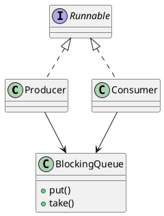

# Producer/Consumer

*Concurrency construct. Also known as the* bounded-buffer problem.

## Problem

Two kinds of threads share a buffer of finite capacity. *Producers* generate items and place them in the buffer; *consumers* remove items and process them. Correctness requires that a producer wait while the buffer is full, that a consumer wait while it is empty, and that concurrent access never corrupts the buffer or loses or duplicates an item.

The problem was posed by Dijkstra in 1965 as the motivating example for semaphores [1], and the same year's work on mutual exclusion frames the general difficulty of coordinating cooperating sequential processes. Hoare [2] and Brinch Hansen [3] later introduced the *monitor*, which bundles the shared data, the operations on it and the condition synchronisation into one construct, and the bounded buffer is the standard illustration in both papers.

## Structure



```plantuml
@startuml
class Producer implements Runnable
class Consumer implements Runnable
class BlockingQueue {
    +put()
    +take()
}
Producer --> BlockingQueue 
Consumer --> BlockingQueue
@enduml
```

## Participants

| Role | Class in this package | Responsibility |
|---|---|---|
| Producer | `Producer` | Puts the integers 1 to 3 into the queue. `put()` blocks while the queue is full. If interrupted, it restores the interrupt flag and returns. |
| Consumer | `Consumer` | Repeatedly `take()`s an item and logs it. `take()` blocks while the queue is empty. The loop ends when the thread is interrupted. |
| Buffer | `java.util.concurrent.LinkedBlockingDeque` (capacity 3) | A `BlockingQueue` implementation that provides the mutual exclusion and the two wait conditions. |
| Coordinator | `ProducerConsumerExampleRunner` | Creates a fixed pool of three threads, starts two consumers and one producer, waits for the producer to finish and the queue to drain, then interrupts the consumers and shuts the pool down. |

## The example

```
Executing Producer/Consumer implementation:
  1: Consumed [ 1]
  2: Consumed [ 2]
  1: Consumed [ 3]
```

Which consumer takes which item is decided by thread scheduling and differs between runs. What does not vary is that each item is consumed exactly once and that `runExample()` returns only after every thread it started has stopped, so the example can be run repeatedly from the window without leaking threads.

## How the buffer works

`BlockingQueue`, added in Java 5 with the `java.util.concurrent` package designed by Lea and specified through JSR 166 [4, 5], encapsulates the monitor. Inside `LinkedBlockingDeque` a `ReentrantLock` provides mutual exclusion and two `Condition` objects, one signalled when the deque becomes non-empty and one when it becomes non-full, provide the condition synchronisation. `put()` acquires the lock, waits on the *not full* condition while the deque is at capacity, links the item and signals *not empty*; `take()` is its mirror image. That is Hoare's monitor with condition variables, realised in library code.

**Companion project.** The repository [java-monitor-example](https://github.com/lpenap/java-monitor-example) by the same author implements this coordination by hand, using Java's intrinsic locks with `synchronized`, `wait()` and `notifyAll()`, and visualises threads contending for a shared pool of integers in real time. It is the recommended next step for readers who want to see what `BlockingQueue` hides.

## Consequences and design notes

* **Decoupling of rates.** Producers and consumers run at their own pace; the buffer absorbs short-term differences.
* **Backpressure.** A *bounded* buffer makes a fast producer wait rather than exhaust memory. Goetz et al. recommend bounded queues by default for exactly this reason [4, §5.3].
* **Thread safety by delegation.** No class in this package contains a lock; safety is delegated entirely to the queue, which is the simplest correct design.
* **Shutdown by interruption.** A consumer blocked in `take()` has no natural end. The coordinator uses `ExecutorService.shutdownNow()`, which interrupts the pool threads; `Consumer` treats interruption as the request to stop, and `Producer` propagates it by re-asserting the flag. This follows the cancellation policy described by Goetz et al. [4, ch. 7]. The alternative is a *poison pill*, a sentinel item that tells a consumer to exit.
* **Lost signals** and **spurious wake-ups**, the classic hazards of hand-written monitors, cannot occur here because the queue's implementation handles them.

## Related constructs

* **Monitor** (see the companion project above): the underlying synchronisation construct.
* **Semaphore**: Dijkstra's original solution uses two counting semaphores, *empty* and *full*, plus a binary semaphore for mutual exclusion; `java.util.concurrent.Semaphore` allows the same construction.
* **Observer**: an asynchronous variant in which consumers are notified rather than blocked.

## References

1. E. W. Dijkstra, "Cooperating Sequential Processes," EWD 123, Technological University Eindhoven, 1965. Reprinted in F. Genuys (ed.), *Programming Languages*, Academic Press, 1968, pp. 43–112.
2. C. A. R. Hoare, "Monitors: An Operating System Structuring Concept," *Communications of the ACM*, vol. 17, no. 10, pp. 549–557, 1974.
3. P. Brinch Hansen, *Operating System Principles*. Prentice-Hall, 1973.
4. B. Goetz, T. Peierls, J. Bloch, J. Bowbeer, D. Holmes and D. Lea, *Java Concurrency in Practice*. Addison-Wesley, 2006, ch. 5 and ch. 7.
5. D. Lea, *Concurrent Programming in Java: Design Principles and Patterns*, 2nd ed. Addison-Wesley, 1999.
