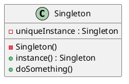

# Singleton Pattern

The singleton pattern ensures a class has only one instance while providing a global point of access to it.

## Class diagram

```plantuml
@startuml
class Singleton {
    -uniqueInstance : Singleton
    -Singleton()
    +instance() : Singleton
    +doSomething()
}
@enduml
```
