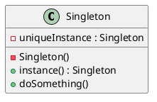

# Singleton

*Creational pattern.*

## Intent

Ensure a class has only one instance, and provide a global point of access to it [1, p. 127].

## Motivation

Some objects must be unique: a print spooler, a window manager, a registry of configuration. A global variable makes the instance accessible but does not stop a second one from being created. Making the class itself responsible for its sole instance solves both problems: the constructor is hidden, and a class operation creates the instance on first use and returns it thereafter.

## Structure




## Participants

| Role [1] | Class in this package | Responsibility |
|---|---|---|
| Singleton | `Singleton` | Private constructor, private static `uniqueInstance`, and the static `instance()` operation that lazily creates and returns it. `doSomething()` stands for the instance's real responsibilities. |

## The example

The runner obtains the instance through `instance()` and calls `doSomething()`. The test asserts that two calls to `instance()` return the same object.

```
Instantiating a Singleton
```

## Consequences

* **Controlled access to the sole instance** and **reduced namespace pollution** compared with a global variable.
* **Permits refinement.** The class can be subclassed and the subclass chosen at run time inside `instance()`.
* **Permits a variable number of instances** by changing only `instance()`, should the requirement change.
* **Hidden dependencies and global state.** Every class that calls `Singleton.instance()` depends on it invisibly, which hampers testing and substitution. This is why the pattern is often called an anti-pattern in modern practice, and why dependency-injection containers prefer to manage uniqueness as a *scope* instead. The Spring context hosting these examples treats every `@Component` as a singleton in exactly this sense, without any of the classes implementing the pattern.

## A note on thread safety

The lazy initialisation in `instance()` is the textbook form and is **not thread-safe**. Two threads that both observe `uniqueInstance == null` before either assigns it will create two instances: a check-then-act race [3, §2.2]. The example is written this way to show the canonical structure. The correct alternatives in Java are:

1. **Eager initialisation**: `private static final Singleton INSTANCE = new Singleton();`. The Java Language Specification guarantees that class initialisation is performed exactly once and is visible to all threads [4, §12.4.2].
2. **The initialisation-on-demand holder idiom**: place the field in a private static nested class, so that the JVM's class-initialisation guarantee provides lazy, thread-safe creation without explicit locking [3, §16.2.3].
3. **An enum with a single constant** [2, Item 3]: concise, serialisation-safe and immune to reflective attacks on the private constructor.
4. **Double-checked locking** with a `volatile` field, which is correct only under the memory model introduced by JSR 133 in Java 5 [5]. The pre-2004 form was famously shown to be broken [6].

## Related patterns

* **Abstract Factory**, **Builder** and **Prototype**: the factories these patterns introduce are frequently singletons.
* **Facade**: usually a singleton.

## References

1. E. Gamma, R. Helm, R. Johnson and J. Vlissides, *Design Patterns: Elements of Reusable Object-Oriented Software*. Addison-Wesley, 1994, pp. 127–134.
2. J. Bloch, *Effective Java*, 3rd ed. Addison-Wesley, 2018, Item 3.
3. B. Goetz, T. Peierls, J. Bloch, J. Bowbeer, D. Holmes and D. Lea, *Java Concurrency in Practice*. Addison-Wesley, 2006, §2.2 and §16.2.
4. J. Gosling, B. Joy, G. Steele, G. Bracha, A. Buckley, D. Smith and G. Bierman, *The Java Language Specification*, Java SE 25 edition, §12.4.
5. J. Manson, W. Pugh and S. V. Adve, "The Java Memory Model," in *Proc. 32nd ACM SIGPLAN-SIGACT Symposium on Principles of Programming Languages (POPL '05)*, 2005, pp. 378–391.
6. D. Bacon et al., "The 'Double-Checked Locking is Broken' Declaration," 2001. Available online.
