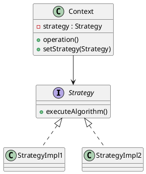

# Strategy Pattern

The strategy pattern defines a family of algorithms, encapsulates each one, and makes them interchangeable at runtime.

## Class diagram

```plantuml
@startuml
interface Strategy {
    +executeAlgorithm()
}
class StrategyImpl1 implements Strategy
class StrategyImpl2 implements Strategy
class Context {
    -strategy : Strategy
    +operation()
    +setStrategy(Strategy)
}
Context --> Strategy
@enduml
```
