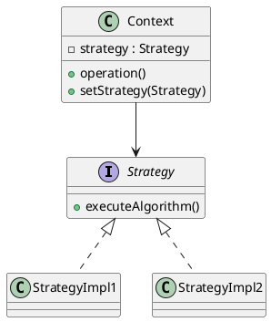

# Strategy

*Behavioural pattern. Also known as* Policy.

## Intent

Define a family of algorithms, encapsulate each one, and make them interchangeable. Strategy lets the algorithm vary independently from clients that use it [1, p. 315].

## Motivation

A text composer may break lines with several algorithms of differing cost and quality. Hard-wiring them into the composer makes it larger, harder to maintain and impossible to extend without editing. Extracting each algorithm into its own class behind a common interface lets the composer hold a reference to *some* strategy and delegate to it, so algorithms can be added, removed or switched at run time without the composer changing.

## Structure




## Participants

| Role [1] | Class in this package | Responsibility |
|---|---|---|
| Strategy | `Strategy` | The interface common to all algorithms: `executeAlgorithm()`. |
| ConcreteStrategy | `StrategyImpl1`, `StrategyImpl2` | Two interchangeable algorithms. |
| Context | `Context` | Configured with a strategy at construction, exposes `setStrategy()` to change it, and delegates to it from `operation()`. |
| Client | `StrategyExampleRunner` | Chooses the strategies and hands them to the context. |

## The example

The runner builds a context with the first strategy, invokes the operation, swaps in the second strategy and invokes it again:

```
Executing Strategy Pattern Implementation
  Operation with --> Algorithm from Strategy Implementation 1
  Operation with ==> Algorithm from Strategy Implementation 2
```

## Consequences

* **Families of related algorithms** can be organised and reused independently of the context.
* **An alternative to subclassing the context**, which would fix the algorithm at compile time and mix it with the context's other responsibilities.
* **Eliminates conditional statements** that would otherwise select behaviour.
* **Clients must be aware of the strategies** in order to choose one, which exposes implementation detail.
* **Communication overhead and object proliferation.** Every strategy shares one interface even if some need less information, and each algorithm is a class.

Since Java 8 a single-method strategy interface is a *functional interface*, so a lambda or method reference can serve as a concrete strategy without a named class. `java.util.Comparator` passed to `List.sort` is the everyday instance: the sort is the context, the comparator the strategy. Bloch discusses this collapse of the pattern's class count as one of the main benefits of lambdas [2, Item 42]. `Strategy` in this package is deliberately kept as an explicit interface with named implementations so that the structure is visible.

## Related patterns

* **Template Method** varies steps of an algorithm through inheritance; Strategy varies the whole algorithm through composition.
* **State** has the same structure, but the context changes its state object as a consequence of its own behaviour, whereas a strategy is chosen by the client.
* **Flyweight**: stateless strategies can be shared.

## References

1. E. Gamma, R. Helm, R. Johnson and J. Vlissides, *Design Patterns: Elements of Reusable Object-Oriented Software*. Addison-Wesley, 1994, pp. 315–323.
2. J. Bloch, *Effective Java*, 3rd ed. Addison-Wesley, 2018, Item 42.
3. E. Freeman and E. Robson, *Head First Design Patterns*, 2nd ed. O'Reilly, 2020, ch. 1.
