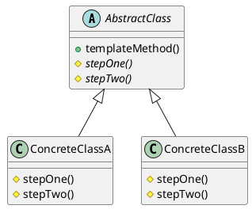

# Template Method Pattern

The template method pattern defines the skeleton of an algorithm in a base class and lets subclasses override specific steps.

## Class diagram

```plantuml
@startuml
abstract class AbstractClass {
    +templateMethod()
    #stepOne() {abstract}
    #stepTwo() {abstract}
}
class ConcreteClassA extends AbstractClass {
    #stepOne()
    #stepTwo()
}
class ConcreteClassB extends AbstractClass {
    #stepOne()
    #stepTwo()
}
@enduml
```
