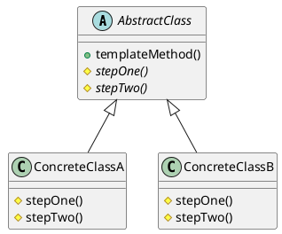

# Template Method

*Behavioural pattern.*

## Intent

Define the skeleton of an algorithm in an operation, deferring some steps to subclasses. Template Method lets subclasses redefine certain steps of an algorithm without changing the algorithm's structure [1, p. 325].

## Motivation

An application framework that opens a document must always perform the same sequence, such as checking the file, creating the document object, adding it to the open set and reading its contents, but only the application knows how to create and read *its* documents. Writing the sequence once in an abstract base class, with the variable steps declared abstract, fixes the order and reuses the invariant parts while leaving the specifics to subclasses. The base class calls the subclass, not the other way round, which Freeman and Robson call the Hollywood principle: "don't call us, we'll call you" [3, ch. 8].

## Structure




## Participants

| Role [1] | Class in this package | Responsibility |
|---|---|---|
| AbstractClass | `AbstractClass` | `templateMethod()` fixes the algorithm as `stepOne()` followed by `stepTwo()`. Both steps are abstract *primitive operations*. |
| ConcreteClass | `ConcreteClassA`, `ConcreteClassB` | Implement the primitive operations. |

Two details of the implementation carry meaning. `templateMethod()` is declared `final`, following the advice that the template method itself should not be overridable, so that subclasses can vary the steps but not the skeleton [1, p. 328]. The primitive operations are `protected`, which signals that they exist to be overridden and are not part of the public interface.

## The example

The runner instantiates each concrete class through the abstract type and calls the template method:

```
Executing Template Method Pattern Implementation
  A step one then A step two
  B step one then B step two
```

The word "then" comes from the base class, the rest from the subclasses.

## Consequences

* **Code reuse.** The invariant part of the algorithm is written once.
* **Inverted control structure.** The parent class calls operations of the subclass. Subclass authors must understand which operations are *hooks* (may be overridden, often with a default) and which are *abstract* (must be overridden).
* **Rigidity.** The variation is chosen at compile time through inheritance. When the steps must be swappable at run time, or when a class would need to vary along several independent axes, Strategy's composition-based approach is preferable. Bloch's advice to favour composition over inheritance and to document a class's self-use pattern if it is designed for inheritance both bear directly on this pattern [2, Items 18 and 19].

`java.util.AbstractList` is a large-scale template: `iterator()`, `indexOf()` and the rest are written in terms of the abstract `get(int)` and `size()`. `javax.servlet.http.HttpServlet.service()` dispatches to `doGet()`, `doPost()` and friends in the same way, and `java.io.InputStream.read(byte[], int, int)` is implemented by repeated calls to the abstract single-byte `read()`.

## Related patterns

* **Factory Method** is often called from within a template method; the Factory Method example in this collection is structured that way.
* **Strategy** uses delegation to vary the entire algorithm; Template Method uses inheritance to vary part of it.

## References

1. E. Gamma, R. Helm, R. Johnson and J. Vlissides, *Design Patterns: Elements of Reusable Object-Oriented Software*. Addison-Wesley, 1994, pp. 325–330.
2. J. Bloch, *Effective Java*, 3rd ed. Addison-Wesley, 2018, Items 18–20.
3. E. Freeman and E. Robson, *Head First Design Patterns*, 2nd ed. O'Reilly, 2020, ch. 8.
